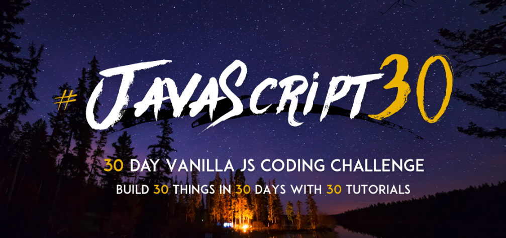

## <h1 align="center">⚡Drums-Proyect</h1> 

Paracticando detectar y responder a eventos de teclado en JavaScript, simulando una batería. 
 

Apendiendo JS con el reto de Javascript 30

## 💟 Preview
  

   
   
  

## 💻 Tecnologías Utilizadas 

## 🌼 URL 
Para interactuar con la plataforma web por favor accede a: <a href="" target="_blank">Drums Proyect</a>

## 🛠 Cómo usar
Cuando se ingresa a la página se pueden visualizar las teclas, las cuales al presionar las relacionadas al teclado, tienen asociado un sonido de batería. 

## ⚙ Recursos Utilizados
<a href="https://javascript30.com/" target="_blank">Javascript 30</a>
- Es un curso gratuito en línea creado por Wes Bos, un desarrollador web y diseñador con experiencia. El curso está diseñado para mejorar las habilidades de programación en JavaScript al enseñar a los estudiantes a construir 30 proyectos diferentes utilizando solo HTML, CSS y JavaScript puro, es decir, sin el uso de bibliotecas o frameworks adicionales

## Estado del Proyecto
 Completo. 

